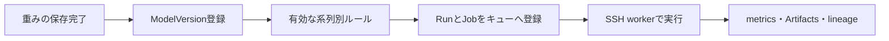

# コンテナとモデル登録後の自動実行

CodeVersionに実行環境とコマンドを登録し、複数のModelVersionで共有します。重みはworkerが実行前に取得し、コンテナへ読み取り専用で渡します。コード版・モデル版・入力DatasetVersionはRunへ固定されます。

## 実行環境を登録する

Codeの版登録画面でPython、Docker、Singularity、Apptainerを選びます。

| 実行環境 | 登録内容 |
|---|---|
| Python | Git/inline/zip・tarのソース、依存関係、実行コマンド |
| Docker | `image@sha256:<64桁>`、コンテナ内の実行コマンド、任意の作業ディレクトリ |
| Singularity/Apptainer | 保存済みSIF Artifact、SHA256、コンテナ内の実行コマンド、任意の作業ディレクトリ |

Dockerのイメージはregistryのdigestで固定します。SIFをアップロードした場合は、ArtifactのSHA256を使います。保存先はProjectの設定に従いS3互換ストレージまたはファイルシステムです。APIへの登録時には外部registryへ接続しません。

コンテナ内にコードが含まれる場合は`source: null`を選べます。Git/inline/zip・tarのソースを追加すると、`/mmt/source`へ読み取り専用で渡します。コンテナの依存関係はイメージに含め、`requirements`は空にします。

例えばDockerの版登録は次の形です。`<digest>`を実際の64桁へ置き換えます。

```json
{
  "version": "v1",
  "source": null,
  "runtime": {
    "kind": "docker",
    "image": "registry.example.org/qwen3-infer@sha256:<digest>",
    "workingDirectory": "/app"
  },
  "entrypoint": ["python", "/app/infer.py"],
  "requirements": [],
  "environment": {},
  "supportedModelFamilies": ["qwen3"],
  "taskTypes": ["inference", "evaluation"]
}
```

実行コマンドはargv配列です。Dockerの起動やmountの組み立てはworkerが行います。アプリの画面から入力する場合も、コマンドと引数をJSON配列で指定します。

ComputeTargetには実行可能な`runtimeKinds`を登録します。実行先のhostにはsupervisor用Pythonが必要です。追加でDocker、Singularity、Apptainerのうち利用するruntimeを用意します。Job登録とworker claimでruntimeの互換性を確認し、実行時にはworkerが実際のCLIの有無を確認します。GPUやregistry接続の準備は[worker手順](worker.md)を参照してください。

## コンテナに渡す入力と出力

| パス・環境変数 | 内容 |
|---|---|
| `/mmt/inputs` / `MMT_MODEL_FILE` | 取得済みのモデル重み、読み取り専用 |
| `/mmt/context` / `MMT_JOB_CONTEXT_FILE` | Runの設定と固定されたモデル・DatasetVersionの情報、読み取り専用 |
| `MMT_PARAMETERS_FILE` | parametersのJSON |
| `MMT_DATASET_VERSIONS_FILE` | 入力データセットのmetadata・URI。任意の外部データそのものは自動取得しない |
| `/mmt/source` | 任意の追加ソース、読み取り専用 |
| `/mmt/outputs` / `MMT_OUTPUTS_DIR` | コンテナが生成する出力 |
| `MMT_RESULT_FILE` | SDKを使わない実行の完了manifest |

SDKを使うコードは、RunのメトリクスやArtifactを既存APIへ保存できます。SDKを含まないイメージは出力ファイルを保存し、最後に`result.json`を確定します。

```json
{
  "version": 1,
  "complete": true,
  "artifacts": [
    {
      "path": "predictions.json",
      "sha256": "<保存したファイルのSHA256>",
      "size": 123,
      "mimeType": "application/json"
    }
  ],
  "metrics": [
    { "name": "evaluation.score", "value": 0.91, "step": 0 }
  ]
}
```

manifestのSHA256とbyte数は実ファイルと一致させます。すべての出力を書き終えてからmanifestを置きます。workerは終了後にmanifestと出力を検証し、metricsとArtifactsをRunへ回収します。詳細な制限と、停止・worker再接続の動作は[worker手順](worker.md)を参照してください。

## モデル登録後に自動実行する

Modelsの自動実行画面で、Project管理者がルールを作ります。対象のモデル系列、Experiment、推論または評価、CodeVersion、DatasetVersion、ComputeTarget、GPU、parametersを指定します。各設定は固定し、有効・無効だけを切り替えます。設定変更は新しいルールとして登録します。



- アップロードしただけのArtifactは起動しません。ModelVersionの登録完了がトリガーです。
- 同じルールとモデル版の組み合わせでは一度だけ起動します。過去モデルの遡及実行は行いません。
- 学習/fine-tuningの出力モデルをSDKで登録した場合も同じルールを適用し、生成元Runへ関連付けます。
- 作成者の現在の管理者権限と参照先を確認します。重み指定なし、権限失効、無効な実行先などは履歴に理由を残します。
- ルールごとの起動失敗はRun/Job作成を取り消して記録し、登録したモデルは保持します。
- 推論と評価のルールはそれぞれ独立したJobです。同じモデルから起動します。

履歴にはキュー登録の結果と現在のRun/Job状態を表示します。失敗や停止の後は、Jobs画面から通常の再実行を行えます。

## APIと実行確認

- `GET/POST /api/projects/:p/automation-rules`
- `PATCH /api/projects/:p/automation-rules/:id`、bodyは`{"enabled": false}`など
- `GET /api/projects/:p/automation-executions`
- `GET /api/projects/:p/artifacts?limit=100&query=.sif`、Project単位の保存済みArtifact一覧
- `GET /api/projects/:p/artifacts/:id`、保存済みArtifactのSHA256・sizeなど

モデル登録から実Dockerへの実行確認は[検証手順](verification.md)の`verify_containers.py`を使います。実GPU、SSH先のruntime、実registry認証とSIF runtimeの実行確認は、接続先で別途行います。

[Dockerの実行仕様](https://docs.docker.com/engine/containers/run/)と[SingularityCE](https://docs.sylabs.io/guides/latest/user-guide/quick_start.html)、[Apptainer](https://apptainer.org/docs/user/latest/quick_start.html)の仕様に合わせて実行します。
