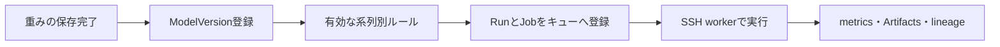
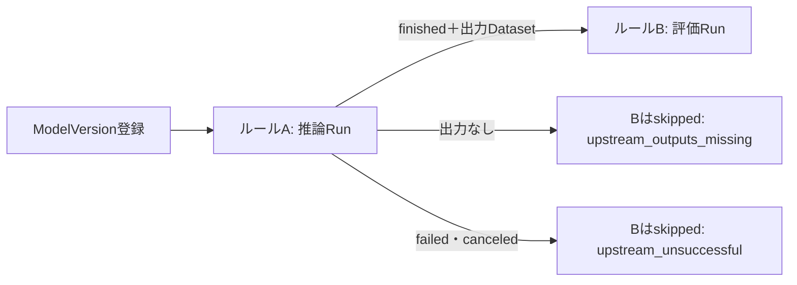

# コンテナとモデル登録後の自動実行

CodeVersionに実行環境とコマンドを登録し、複数のModelVersionで共有します。重みはworkerが実行前に取得し、コンテナへ読み取り専用で渡します。コード版・モデル版・入力DatasetVersionはRunへ固定されます。

## 実行環境を登録する

Codeの版登録画面でPython、Docker、Singularity、Apptainerを選びます。

| 実行環境 | 登録内容 |
|---|---|
| Python | Git/inline/zip・tarのソース、依存関係、実行コマンド |
| Docker | `image@sha256:<64桁>`、コンテナ内の実行コマンド、任意の作業ディレクトリ |
| Singularity/Apptainer | 保存済みSIF Artifact、SHA256、コンテナ内の実行コマンド、任意の作業ディレクトリ |

Dockerのイメージはregistryのdigestで固定します。SIFをアップロードした場合は、ArtifactのSHA256を使います。保存先はProjectの設定に従いS3互換ストレージまたはファイルシステムです。CodeVersionの登録時には外部registryへ接続しません（Job・Task・rule・フックの保存時のCPUの照合は、`MMT_IMAGE_PLATFORM_CHECK=enforce`のときだけ行います。[api-contract.md](api-contract.md)の「imageのCPU照合」）。

コンテナ内にコードが含まれる場合は`source: null`を選べます。Git/inline/zip・tarのソースを追加すると、`/mmt/source`へ読み取り専用で渡します。コンテナの依存関係はイメージに含め、`requirements`は空にします。

例えばDockerの版登録は次の形です。`<digest>`を実際の64桁へ置き換えます。

```json
{
  "version": "v1",
  "source": null,
  "runtime": {
    "kind": "docker",
    "image": "registry.example.org/qwen3-infer@sha256:<digest>",
    "workingDirectory": "/app"
  },
  "entrypoint": ["python", "/app/infer.py"],
  "requirements": [],
  "environment": {},
  "supportedModelFamilies": ["qwen3"],
  "taskTypes": ["inference", "evaluation"]
}
```

実行コマンドはargv配列です。Dockerの起動やmountの組み立てはworkerが行います。アプリの画面から入力する場合も、コマンドと引数をJSON配列で指定します。

ComputeTargetには実行可能な`runtimeKinds`を登録します。実行先のhostにはsupervisor用Pythonが必要です。追加でDocker、Singularity、Apptainerのうち利用するruntimeを用意します。Job登録とworker claimでruntimeの互換性を確認し、実行時にはworkerが実際のCLIの有無を確認します。GPUやregistry接続の準備は[worker手順](worker.md)を参照してください。

## コンテナに渡す入力と出力

| パス・環境変数 | 内容 |
|---|---|
| `/mmt/inputs` / `MMT_MODEL_FILE` | 取得済みのモデル重み、読み取り専用 |
| `/mmt/context` / `MMT_JOB_CONTEXT_FILE` | Runの設定と固定されたモデル・DatasetVersionの情報、読み取り専用 |
| `MMT_PARAMETERS_FILE` | parametersのJSON |
| `MMT_DATASET_VERSIONS_FILE` | 入力データセットのmetadata・URI。任意の外部データそのものは自動取得しない |
| `/mmt/source` | 任意の追加ソース、読み取り専用 |
| `/mmt/outputs` / `MMT_OUTPUTS_DIR` | コンテナが生成する出力 |
| `MMT_RESULT_FILE` | SDKを使わない実行の完了manifest |

SDKを使うコードは、RunのメトリクスやArtifactを既存APIへ保存できます。SDKを含まないイメージは出力ファイルを保存し、最後に`result.json`を確定します。

```json
{
  "version": 1,
  "complete": true,
  "artifacts": [
    {
      "path": "predictions.json",
      "sha256": "<保存したファイルのSHA256>",
      "size": 123,
      "mimeType": "application/json"
    }
  ],
  "metrics": [
    { "name": "evaluation.score", "value": 0.91, "step": 0 }
  ]
}
```

manifestのSHA256とbyte数は実ファイルと一致させます。すべての出力を書き終えてからmanifestを置きます。workerは終了後にmanifestと出力を検証し、metricsとArtifactsをRunへ回収します。詳細な制限と、停止・worker再接続の動作は[worker手順](worker.md)を参照してください。

### 出力が多いとき（音声の推論など）

出力ファイルは1つのJobで10000件まで保存できます（workerの`MMT_WORKER_MAX_OUTPUT_FILES`で変更）。`result.json`は1MiBまでなので、数千件のファイルは`result.json`に並べず、JSON Linesのファイル（1行に1件`{"path","sha256","size","mimeType"}`）に書いて`artifactsManifest`で指します。このときは`"version": 2`にします。

```json
{"version": 2, "complete": true, "artifactsManifest": "artifacts.jsonl"}
```

`artifacts.jsonl`と`result.json`自身はRun Artifactとして保存されません。workerは出力を1本のtar streamでまとめて受け取るので、ファイル数が多くてもSSH接続は1回です。途中で接続が切れた場合は、保存できていないファイルだけを取り直します。

### 学習結果のモデルやデータセットを登録する

学習結果のモデルや、推論・前処理で作ったデータセットを、SDKなしで登録したいときは`result.json`をversion 2にして`models`と`datasets`を書きます。

```json
{
  "version": 2,
  "complete": true,
  "artifacts": [{"path": "model/weights.bin", "sha256": "<64桁hex>", "size": 1048576}],
  "models": [{"path": "model/weights.bin"}]
}
```

- `modelId`を省略すると、Taskの「成功時に出力モデルを登録」で選んだModelへ登録します。Taskで設定していない場合は`modelId`を書きます。Taskと別のModelは指定できません（どちらに登録されたか分からなくなるため）。
- 同じModelをTaskでも設定している場合、登録は宣言の1回だけで、下流の推論・評価も1回だけ起動します。
- 宣言したモデルの推論・評価は、学習Runが成功してから起動します。失敗・キャンセルなら起動しません。
- `datasets`は`{datasetId, path または uri, digest, schema?, metadata?}`。`path`の場合、版のURIは`mmt-artifact://runs/<RunのID>/container/<path>`になり、評価の表から同じ形で参照できます。
- モデルを宣言できるのはtraining / finetuningのRunだけです。workerのtokenに`registry:write`が要ります（無いとJobはfailedになります）。

### 出力の上限

| 項目 | 上限 |
|---|---|
| 出力ファイル数 | 10000（`MMT_WORKER_MAX_OUTPUT_FILES`） |
| `result.json` | 1MiB |
| `artifactsManifest`の1行 | 4KiB |
| metrics | 1000点 |
| `models` / `datasets` | 16件 / 64件 |

### 評価コンテナが書く結果ファイル

評価の自動実行で動くコンテナは、サンプルごとの結果を`eval/results.jsonl`のようなjsonlで出力すると、Webで音声を聴きながら確認できます。列名は`audio`・`reference`・`prediction`・`score`です。形式は[評価サンプルの推奨形式](evaluation.md#評価サンプルの推奨形式)を参照してください。

推論Runが出力した音声を評価Runの表から指すときは、評価Runへコピーせず`mmt-artifact://runs/<推論RunのID>/<保存パス>`と書きます。推論RunのIDは、入力DatasetVersion（`MMT_DATASET_VERSIONS_FILE`）のうち推論の出力にあたる版の`sourceRunId`から取れます。同じProjectのRunだけ解決します。`/mmt/outputs`から回収したファイルの保存パスは`container/<path>`です。

## モデル登録後に自動実行する

Modelsの自動実行画面で、Project管理者がルールを作ります。対象のモデル系列、Experiment、推論または評価、CodeVersion、DatasetVersion、ComputeTarget、GPU、parametersを指定します。各設定は固定し、有効・無効だけを切り替えます。設定変更は新しいルールとして登録します。



- アップロードしただけのArtifactは起動しません。ModelVersionの登録完了がトリガーです。
- 同じルールとモデル版の組み合わせでは一度だけ起動します。過去モデルの遡及実行は行いません。
- 学習/fine-tuningの出力モデルをSDKやMLflowで登録した場合も同じルールを適用し、生成元Runへ関連付けます。起動は学習Runの成功まで待ちます（次の節）。
- ルールの所有者（作成時は作成者）の現在の管理者権限と参照先を確認します。重み指定なし、権限失効、無効な実行先などは履歴に理由を残し、通知ルールで`automation.failed`を選んでいれば通知します。
- ルールごとの起動失敗はRun/Job作成を取り消して記録し、登録したモデルは保持します。
- 推論と評価のルールはそれぞれ独立したJobです。評価に推論の出力を渡すときは、評価ルールを推論ルールの後段にします（「推論の後に評価を回す」の節）。

### 学習Run中に登録した版は学習の成功を待つ

SDKの`register_output_model`やMLflowの`log_model(registered_model_name=…)`は、学習Runの実行中に版を登録します。その後に学習が失敗しても推論・評価が動かないように、生成元Run（`sourceRunId`）が終わっていない版は、その場では起動せず保留にします。

| 生成元Runの状態 | 自動実行 |
|---|---|
| 生成元Runなし、または登録時点で終了済み | 登録と同時に起動（従来どおり） |
| 実行中のまま | 保留。履歴に「学習完了待ち」と表示 |
| 保留中にfinished | その時点で有効なルールで起動し、自動Runの親を学習Runにする |
| 保留中にfailed・canceled | 起動せず、`skipped`（`source_run_unsuccessful`）を記録 |
| 保留から7日を超えた、または学習Runを削除した | 起動せず、`skipped`（`source_run_timeout`）を記録 |

- 対象のルールは「学習Runが終わった時点で有効なルール」です。保留中に無効化したルールは起動せず、保留中に作ったルールは起動します。保留中の履歴には、その時点で有効なルールが表示されます。
- 終了の通知を何度受けても（worker completeの再送、MLflowの`FINISHED→RUNNING→FINISHED`）、同じ版を2回起動しません。いったん失敗・期限切れで閉じた保留は、その後に学習Runが成功しても起動しません。
- 期限切れの判定は、API内の点検処理が10分ごとに行います。状態がunknownのままのJobや、`end_run`されないMLflowのRunで保留が残り続けるのを防ぐためです。期限は7日（168時間）で、長い学習より長く取っています。複数のAPI processが動いていても、点検は1か所だけで実行します。
- 期限切れや学習失敗で起動しなかった版を後から動かすには、「既存の版へ手動で適用する」の手順で適用します。

履歴にはキュー登録の結果と現在のRun/Job状態を表示します。失敗や停止の後は、Jobs画面から通常の再実行を行えます。ルールで試行回数を2以上にしていれば、失敗は自動で再試行します（「失敗した自動実行を自動で再試行する」の節）。

### 推論の後に評価を回す（ルールの連鎖）

ルールの起動条件（`trigger`）は2種類です。

| trigger | 起動するとき |
|---|---|
| `model_registered`（既定） | ModelVersionの登録（前節まで） |
| `upstream_run_finished` | 上流に指定したルール（`upstreamRuleId`）が作ったRunが終わったとき |

推論ルールAを作り、評価ルールBを「上流＝A」で作ると、版の登録でAの推論Runが動き、それが成功した時点でBの評価Runが起動します。種類（`kind`）は推論・評価に加えて`processing`（前処理・後処理）も選べます。



- 評価Runは推論と同じ版で作ります。入力DatasetVersionは、Bに固定した分（正解セット）と、推論Runが出力したDatasetVersionの両方です。推論の出力は`upstreamDatasetVersionIds`にも記録し、[評価結果の比較](evaluation.md)では正解セットだけで条件の一致を判定します。
- 評価Runの親Runは推論Runです。workerは親Runを上流Runとしてコンテナへ渡します（`MMT_UPSTREAM_RUN_ID`と`upstream-run.json`。詳細は[worker手順](worker.md)）。
- 推論の出力は、推論Runの実行中または`result.json`の回収時にDatasetVersion（`sourceRunId`＝推論Run）として登録します。出力のDatasetVersionが1件も無いまま推論Runが成功すると、評価は起動せず`upstream_outputs_missing`を記録します。
- 上流は、そのRunを作った自動実行の記録（execution）で特定します。人が作ったRunは、`automation.ruleId` tagが付いていても連鎖しません。
- 推論Runが失敗し、Jobs画面から再実行して成功した場合は、その再実行のRunを上流として評価を起動します。
- 上流のルールを無効にすると、すでに動いている上流Runが成功しても下流は起動しません。下流のルールを無効にした場合も起動しません。
- 連鎖は1段目（登録で起動するルール）を含めて5段までです。上流には同じProjectの有効なルールだけを指定できます。
- 同じパイプラインのRunには、1段目のexecution IDを`automation.pipelineRoot` tagとして付けます。履歴では`pipelineRootExecutionId`でまとめて表示できます。

### 既存の版へ手動で適用する

Project管理者は、有効なルールを既存の版へ手動で適用できます。登録時にルールが無かった版、学習失敗や期限切れで起動しなかった版、基準版への再評価に使います。

- 登録で起動するルールには版（`modelVersionId`）を、連鎖するルールには上流Run（`triggerRunId`）を指定します。上流Runは、そのルールの上流ルールが作ったRunで、成功していて出力DatasetVersionがあるものに限ります。
- 同じルールと版の実行が待機中・実行中なら受け付けません（409）。終わっていれば、試行回数（`attempt`）を1つ増やして新しいRunを作ります。履歴には手動（`source: manual`）と実行した人を残し、監査ログに`automation.execution.manual`を記録します。
- 手動で適用した推論Runが成功すると、後段の評価ルールは通常どおり連鎖します。
- 自動実行履歴とモデル版の画面では、終わった行の「再実行」から同じルールを同じ版（連鎖するルールは同じ上流Run）へ適用し直せます。中身は上の手動適用と同じで、Project管理者にだけ表示します。

### 失敗した自動実行を自動で再試行する

ルールの試行回数（`maxAttempts`）を2以上にすると、自動実行のRunが失敗したときに次の試行を自動で登録します。既定は1で、再試行しません。GPUを無駄に使わないよう、再試行してよいルールだけで明示します。

| 自動実行のRunの終わり方 | 自動再試行 |
|---|---|
| RunとJobがfailed、試行回数が上限未満 | 次の試行のRunとJobを登録（履歴に「n回目の失敗を自動で再試行」） |
| 試行回数が上限に達した | しない |
| canceled（人が中止した） | しない |
| ルールが無効 | しない |
| 人が作ったRun、Jobs画面で人が再実行したRun | しない |

- 再試行のRunとJobは、Jobs画面の再実行と同じ形で作ります（`retry_of_job_id`が元のJob）。checkpointからは再開せず、最初からやり直します。途中から再開したいときは、Jobs画面の再実行でcheckpointを選びます。
- 再試行のRunの親は、元のRunと同じ学習Runまたは上流Runです。連鎖の評価Runを再試行しても、コンテナには推論Runが上流として渡ります。
- 再試行したRunが成功すると、後段のルールは通常どおり連鎖します。失敗した回のRunには、後段の`upstream_unsuccessful`の記録が残ります。
- workerの完了通知の再送やMLflowの再開で同じRunが何度終わっても、1回の失敗につき再試行は1回だけです。
- 自動実行が作るJobの再実行上限は、ルールの試行回数と3の大きい方です。自動再試行しないルールでも、Jobs画面から人が再実行できます。
- この機能より前に作ったルールは、当時の既定の試行回数3のままです。失敗すると最大3回まで自動で再試行します。止めたいときは、そのルールを無効にして試行回数1で作り直します。

### ルールの所有者をService Accountへ移す

自動実行は、ルールの所有者の権限で起動し、所有者を作成者とするRunを作ります。作成時の所有者は作成者です。作成者が異動などでProjectの管理者でなくなると、ルールは`creator_access_revoked`で起動しなくなります。長く使うルールは、人に紐付かないService Accountへ所有者を移しておきます。

1. プロジェクト設定で、role adminのService Accountを作ります（tokenの発行は不要です）。
2. Modelsの自動実行ルールで対象のルールを選び、「Service Accountへ移す」で移管先を選んで確定します。
3. ルール詳細の「所有者」が`<名前>（Service Account）`になったことを確かめます。

- 移管できるのはProject管理者だけです。移管先は同じProjectの有効なService Accountで、roleがadminのものに限ります。
- 作成者（`createdBy`）の記録は変わりません。監査ログに`automation_rule.owner.transfer`を残します。
- 所有者以外のルールの設定は、移管しても変わりません。


### 評価コードを直したときの運用

ルールの設定は不変です。評価コード（CodeVersion）を直したら、次の手順で評価をそろえます。

1. 新しいCodeVersionで評価ルールを作ります。上流は従来と同じ推論ルールにします。
2. 古い評価ルールを無効にします。
3. 基準版（`production` aliasなど）の推論Runを指定して、新しい評価ルールを手動で適用します。推論はやり直さず、評価だけを新しいコードで回します。

[評価結果の比較](evaluation.md)は評価コードの版が一致するRunどうしで行うため、基準版も新しいコードで評価しておかないと、新しい版の評価に比べる相手がいません。


## APIと実行確認

- `GET/POST /api/projects/:p/automation-rules`
- `PATCH /api/projects/:p/automation-rules/:id`、bodyは`{"enabled": false}`など
- `GET /api/projects/:p/automation-executions`
- `POST /api/projects/:p/automation-rules/:id/executions`、bodyは`{"modelVersionId": "…"}`または`{"triggerRunId": "…"}`
- `PUT /api/projects/:p/automation-rules/:id/owner`、bodyは`{"serviceAccountId": "…"}`
- `GET /api/projects/:p/artifacts?limit=100&query=.sif`、Project単位の保存済みArtifact一覧
- `GET /api/projects/:p/artifacts/:id`、保存済みArtifactのSHA256・sizeなど

モデル登録から実Dockerへの実行確認は[検証手順](verification.md)の`verify_containers.py`を使います。実GPU、SSH先のruntime、実registry認証とSIF runtimeの実行確認は、接続先で別途行います。

[Dockerの実行仕様](https://docs.docker.com/engine/containers/run/)と[SingularityCE](https://docs.sylabs.io/guides/latest/user-guide/quick_start.html)、[Apptainer](https://apptainer.org/docs/user/latest/quick_start.html)の仕様に合わせて実行します。
